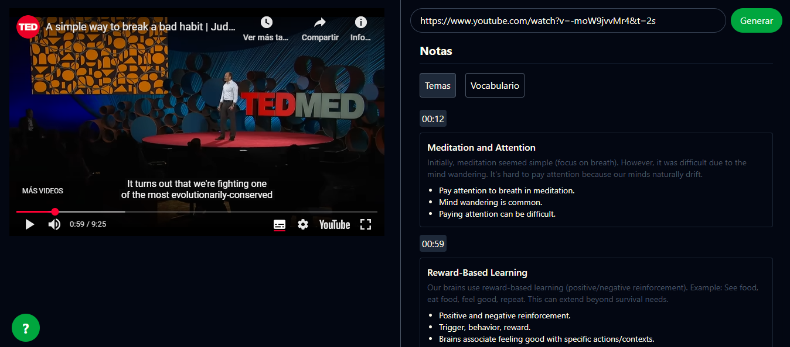
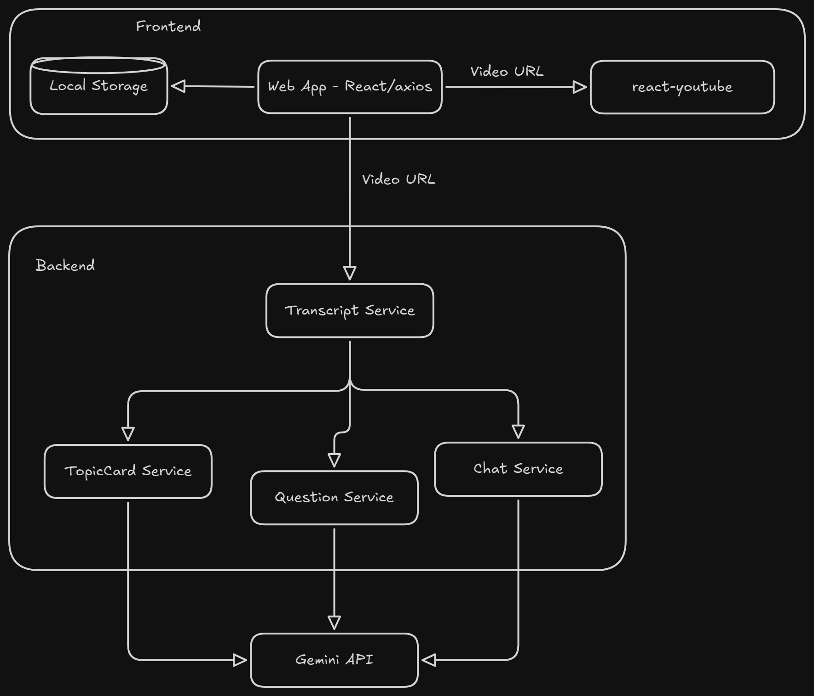

# AnglonYT

Self-hosted and open-source application for learning English through YouTube videos and AI.

## TODOs
- [X] YouTube Client
- [X] AI Integrations
- [ ] Chat to resolve questions
- [ ] Interactive Notes and Questions
- [ ] Easy deployment with Docker


## Tech Stack
- **Frontend**
  - Vite
  - React
  - Axios
  - Zustand
  - TailwindCSS
  - react-youtube
- **Backend**
  - Flask
  - youtube-transcript-api
  - google-genai
- **Deploy**
  - Docker


## Quick Setup 🛠️

1. Clone and Setup Environment:
```bash
git clone https://github.com/primaveraopensource/anglonyt.git
cd anglonyt
cp .env.example .env
```

Copy content of `.env.example` to `.env` and replace variable values for your own [Gemini API Key](https://ai.google.dev/)

**Start Development Environment:**
```bash
# Build and start all services
docker-compose up
```

## Project Struture

```markmap
anglonyt/
├── client/
│   ├── public/
│   ├── src/
│   │   ├── services/
│   │   ├── components/
│   │   ├── models/
│   │   ├── stores/
│   │   ├── App.jsx
│   │   ├── main.jsx
│   │   └── ...
│   ├── package.json
│   ├── vite.config.js
│   └── ...
├── server/
│   │   ├── services/
│   │   ├── transcript_service.py
│   │   ├── topic_service.py
│   │   ├── question_service.py
│   │   └── chat_service.py
│   ├── app.py
│   ├── requirements.txt
│   ├── routes.py
│   └── Dockerfile
├── docker-compose.yml
└── README.md
```

## Architecture


